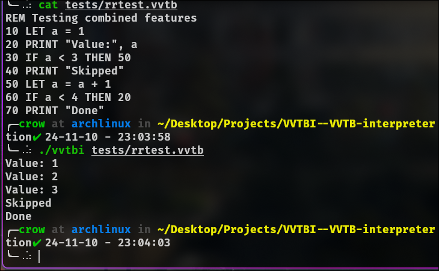

# SUBARU (Spiritually Unbridled Basic Arithmetic Resolver Unit)

_A mystic interpreter born from the Witch's blessing, capable of decoding cryptic messages through the ancient magic of BASIC-like commands._

## 🌟 Divine Blessings (Features)

- Numerical enchantments (line numbers) to maintain the flow of mana
- PRINT incantations to manifest thoughts into reality
- Variable binding magic (LET statements) to store ethereal values
- Conditional spirit gates (IF/THEN) for diverging paths
- Sacred inscriptions (REM) to document the arcane
- Arithmetic crystallization for basic mathematical operations

## 🗡️ Forging the Spell (Building and Running)

```bash
make clean      # Cleanses previous builds
make            # Manifests the interpreter
make test       # Test its powers
make debug      # Check if it is being truthful
make test_debug # So you really dont trust the compiler huh
./subaru your_spell.sub
```

## 📜 Ancient Scroll Example

```basic
10 REM As witnessed by rem in the Roswaal Mansion
20 LET m = 5
30 PRINT "Subaru's current mana level: ", m
40 IF m > 3 THEN 50
50 PRINT "Return by De... [Message corrupted]"
60 PRINT "Rem believes in Subaru-kun!"
```

## ✨ Manifestation

When properly channeled, the interpreter reveals Subaru's messages:

```
Subaru's current mana level: 5
Rem believes in Subaru-kun!
```

### Example



## 📖 Grimoire License

This magical artifact is bound by the Apache License, Version 2.0.
For the complete binding contract, consult: http://www.apache.org/licenses/LICENSE-2.0

## 🌸 Gratitude to the Spirit Arts Users

- Original SUBARU concept blessed by Jahan Addison (Spirit Arts Master) `<jahan[at]jahanaddison[dot]com>`
- Deep gratitude to Rem for her unwavering support in debugging Subaru's messages
- This incarnation is maintained by Daniel, apprentice to the Witch of Pride `<nnamdidaniel114[at]gmail.com>`

## 📝 Message from the Witch Cultist

This implementation of SUBARU, while perhaps not as refined as Beatrice's library of spells, serves as an educational journey into the art of interpreter creation and C++ enchantments. It illuminates core mysteries such as:

- Lexical divination
- Token-based prophecy
- Mana flow control
- Error barrier generation
- Magical I/O streams

As Subaru often says, "The path of greatest resistance leads to the strongest growth."

Should you wish to summon me for questions or feedback: `nnamdidaniel114[at]gmail.com`

_Remember: This interpreter can only manifest once per checkpoint. Choose your commands wisely._
